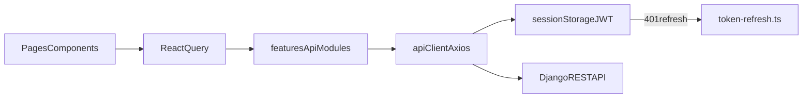

## **Frontend API Reference**

This document describes how the LSIMS frontend connects to the Django REST API: local setup, authentication, environment variables, endpoint catalog, TypeScript types, and React Query conventions.

For backend Sprint 3 scope and staging Swagger access, see `docs/sprint3-report.md` and `docs/swagger-access.md`.

---

## **1 Local Development Access**

| **Item** | **Value** |
|---|---|
| Frontend dev server | `npm run dev` in `LSIMS-Frontend/` (Vite, typically `http://localhost:5173`) |
| API base URL | `VITE_API_BASE_URL` in `LSIMS-Frontend/.env` – default `http://localhost:8000` |
| Dev proxy fallback | If base URL is empty in dev, Vite proxies `/api` → `VITE_PROXY_API` (default `http://127.0.0.1:8000`) |
| Backend Swagger | `https://lsims-api-staging.onrender.com/api/docs/` |

### **Start Commands**

```bash
# From repository root
docker compose up

# In LSIMS-Frontend/
npm install
npm run dev
```

Open the app at `http://localhost:5173/login`.

---

## **2 HTTP Client and Authentication**

### **2.1 Request Flow**



### **2.2 Core Files**

| **File** | **Purpose** |
|---|---|
| `LSIMS-Frontend/src/api/client.ts` | Axios instance, Bearer interceptor, 401 retry |
| `LSIMS-Frontend/src/api/token-refresh.ts` | Refresh token POST (separate Axios call to avoid interceptor loop) |
| `LSIMS-Frontend/src/lib/auth-storage.ts` | Stores `lsims_access` and `lsims_refresh` in `sessionStorage` |
| `LSIMS-Frontend/src/lib/api-error.ts` | Parses DRF `detail` and field errors for toast messages |
| `LSIMS-Frontend/src/stores/auth-store.ts` | Zustand session state; bootstraps profile on load |
| `LSIMS-Frontend/src/config/env.ts` | Reads `VITE_API_BASE_URL` and `VITE_APP_NAME` |

### **2.3 Auth Behavior**

1. **Login:** `POST /api/auth/token/` → store access + refresh tokens → `GET /api/accounts/profile/`.
2. **Authenticated requests:** Request interceptor adds `Authorization: Bearer <access>`.
3. **401 handling:** On 401 (except login/register paths), call `POST /api/auth/token/refresh/`, retry once with new access token.
4. **Refresh failure:** Clear session and redirect to login flow.

Auth paths **excluded** from 401 refresh retry:

- `/api/auth/token/`
- `/api/auth/register/`

There is **no native `fetch`** in application source – all HTTP goes through Axios.

---

## **3 Environment Variables**

| **Variable** | **Purpose** | **Default / Notes** |
|---|---|---|
| `VITE_API_BASE_URL` | Axios `baseURL` | `http://localhost:8000` in `.env`; empty string fallback in dev enables Vite proxy |
| `VITE_APP_NAME` | App branding in UI | `LSIMS` |
| `VITE_PROXY_API` | Vite dev proxy target only (not read by Axios) | `http://127.0.0.1:8000` or `http://backend:8000` in Docker |

---

## **4 API Module Map**

| **Module File** | **Domain** |
|---|---|
| `src/features/auth/api.ts` | Login, register, profile GET, password reset OTP |
| `src/features/profile/api.ts` | Profile PATCH/PUT; self-service `changeOwnPassword` |
| `src/features/accounts/admin-api.ts` | Users CRUD, change-password |
| `src/features/accounts/departments-api.ts` | Departments CRUD |
| `src/features/accounts/roles-api.ts` | Roles CRUD |
| `src/features/accounts/lab-clients-api.ts` | Client picker list |
| `src/features/accounts/lab-analysts-api.ts` | Analyst picker list |
| `src/features/jobs/api.ts` | Job orders, result summary |
| `src/features/laboratory/staff-api.ts` | Tests, samples, sample-tests, assign-analyst |
| `src/features/laboratory/financial-records-api.ts` | Financial records CRUD |
| `src/features/laboratory/preparation-records-api.ts` | Preparation CRUD + start/complete |
| `src/features/laboratory/analysis-results-api.ts` | Analysis CRUD + submit/approve/reject |
| `src/features/laboratory/calibration-records-api.ts` | Calibration CRUD |
| `src/features/laboratory/qc-decisions-api.ts` | QC decisions (read-only) |
| `src/features/laboratory/complaints-api.ts` | Complaints CRUD + resolve/reject |
| `src/features/laboratory/discount-approvals-api.ts` | Discount CRUD + approve/reject |
| `src/features/laboratory/priority-alerts-api.ts` | Priority alerts list |
| `src/features/laboratory/laboratory-query-keys.ts` | Shared React Query key factories for lab workflows |
| `src/features/notifications/api.ts` | Inbox notifications |

**Unused modules (not imported by UI):**

- `src/features/laboratory/test-catalog-api.ts` – wrapper over `fetchTestCatalog`; not imported

---

## **5 Complete Endpoint Catalog**

Paths are relative to `VITE_API_BASE_URL`. Query parameters are noted where the client sends them.

### **5.1 Authentication**

| **Method** | **Endpoint** | **Function** | **Response Type** |
|---|---|---|---|
| POST | `/api/auth/token/` | `loginRequest` | `TokenPair` |
| POST | `/api/auth/register/` | `registerRequest` | `RegisterResponse` |
| POST | `/api/auth/token/refresh/` | `refreshAccessToken` | `{ access: string }` |
| POST | `/api/auth/password-reset-request/` | `requestPasswordReset` | `{ detail: string }` |
| POST | `/api/auth/password-reset-confirm/` | `confirmPasswordReset` | `{ detail: string }` |
| GET | `/api/accounts/profile/` | `fetchProfile` | `AuthUser` |

### **5.2 Profile**

| **Method** | **Endpoint** | **Function** | **Response Type** |
|---|---|---|---|
| PATCH | `/api/accounts/profile/` | `updateProfile` | `AuthUser` |
| PUT | `/api/accounts/profile/` | `replaceProfile` *(exported, unused in UI)* | `AuthUser` |
| POST | `/api/accounts/profile/change-password/` | `changeOwnPassword` | `{ detail: string }` |
| POST | `/api/accounts/users/:userId/change-password/` | `changeOwnPasswordAsAdmin` → `adminChangeUserPassword` *(admin editing another user only)* | `ApiDetailResponse` |

### **5.3 Accounts – Users**

| **Method** | **Endpoint** | **Function** | **Query Params** | **Response Type** |
|---|---|---|---|---|
| GET | `/api/accounts/users/` | `fetchAdminUsers` | `page`, `search`, `user_type`, `role__role_name`, `is_active` | `DrfPaginated<AdminUserRow>` |
| GET | `/api/accounts/users/:id/` | `fetchAdminUser` | — | `AdminUserRow` |
| POST | `/api/accounts/users/` | `createAdminUser` | — | `AdminUserCreateResponse` |
| PATCH | `/api/accounts/users/:userId/` | `patchAdminUser` | — | `AdminUserRow` |
| DELETE | `/api/accounts/users/:userId/` | `deactivateAdminUser` | — | `ApiDetailResponse` |
| POST | `/api/accounts/users/:userId/change-password/` | `adminChangeUserPassword` | body: `{ new_password }` | `ApiDetailResponse` |

Helper wrappers (same users endpoint, filtered):

- `fetchExternalClients` – `user_type=external`
- `fetchAnalystUsers` – `user_type=internal`, `role__role_name=analyst` *(not used by UI; dedicated endpoints below)*

### **5.4 Accounts – Roles**

| **Method** | **Endpoint** | **Function** | **Response Type** |
|---|---|---|---|
| GET | `/api/accounts/roles/` | `fetchRoles` | `RoleRecord[]` (returns `.results`) |
| GET | `/api/accounts/roles/:id/` | `fetchRole` *(unused in UI)* | `RoleRecord` |
| POST | `/api/accounts/roles/` | `createRole` | `RoleRecord` |
| PATCH | `/api/accounts/roles/:id/` | `patchRole` | `RoleRecord` |
| PUT | `/api/accounts/roles/:id/` | `replaceRole` *(unused in UI)* | `RoleRecord` |
| DELETE | `/api/accounts/roles/:id/` | `deleteRole` | — |

### **5.5 Accounts – Departments**

| **Method** | **Endpoint** | **Function** | **Response Type** |
|---|---|---|---|
| GET | `/api/accounts/departments/` | `fetchDepartments` | `DrfPaginated<DepartmentRecord>` |
| GET | `/api/accounts/departments/:id/` | `fetchDepartment` | `DepartmentRecord` |
| POST | `/api/accounts/departments/` | `createDepartment` | `DepartmentRecord` |
| PATCH | `/api/accounts/departments/:id/` | `patchDepartment` | `DepartmentRecord` |
| DELETE | `/api/accounts/departments/:id/` | `deleteDepartment` | — |

### **5.6 Accounts – Lab Pickers**

| **Method** | **Endpoint** | **Function** | **Response Type** |
|---|---|---|---|
| GET | `/api/accounts/clients/` | `fetchLabClients` | `AdminUserRow[]` |
| GET | `/api/accounts/analysts/` | `fetchLabAnalysts` | `AdminUserRow[]` |

### **5.7 Laboratory – Job Orders**

| **Method** | **Endpoint** | **Function** | **Query Params** | **Response Type** |
|---|---|---|---|---|
| GET | `/api/laboratory/jobs/` | `fetchJobOrders` | `page`, `search`, `current_status`, `priority`, `is_cancelled`, `ordering` | `DrfPaginated<JobOrder>` |
| GET | `/api/laboratory/jobs/:id/` | `fetchJobOrder` | — | `JobOrder` |
| GET | `/api/laboratory/jobs/:id/result-summary/` | `fetchJobResultSummary` | — | `JobResultSummary` |
| POST | `/api/laboratory/jobs/` | `createClientJobRequest`, `createStaffJob` | — | `JobOrder` |
| PATCH | `/api/laboratory/jobs/:id/` | `patchJobOrder`, `cancelJobOrder` | — | `JobOrder` |
| DELETE | `/api/laboratory/jobs/:id/` | `softCancelJobOrder`, `cancelJobOrder` | — | — |

### **5.8 Laboratory – Test Catalog**

| **Method** | **Endpoint** | **Function** | **Query Params** | **Response Type** |
|---|---|---|---|---|
| GET | `/api/laboratory/tests/` | `fetchTestCatalog` | `page`, `search`, `is_active` | `DrfPaginated<TestCatalogItem>` |
| POST | `/api/laboratory/tests/` | `createTestCatalogItem` | — | `TestCatalogItem` |
| GET | `/api/laboratory/tests/:id/` | `fetchTestCatalogItem` *(unused in UI)* | — | `TestCatalogItem` |
| PATCH | `/api/laboratory/tests/:id/` | `patchTestCatalogItem` | — | `TestCatalogItem` |
| DELETE | `/api/laboratory/tests/:id/` | `deleteTestCatalogItem` | — | — |

### **5.9 Laboratory – Samples**

| **Method** | **Endpoint** | **Function** | **Query Params** | **Response Type** |
|---|---|---|---|---|
| GET | `/api/laboratory/samples/` | `fetchSamples` | `page`, `search`, `job`, `sample_status` | `DrfPaginated<SampleRecord>` |
| GET | `/api/laboratory/samples/:id/` | `fetchSample` | — | `SampleRecord` |
| POST | `/api/laboratory/samples/` | `createSample` | — | `SampleCreateResponse` |
| POST | `/api/laboratory/samples/:id/assign-analyst/` | `assignSampleAnalyst` | body: `{ assigned_analyst, reassigned_reason? }` | `SampleRecord` |
| PATCH | `/api/laboratory/samples/:id/` | `patchSample` | — | `SampleRecord` |
| DELETE | `/api/laboratory/samples/:id/` | `deleteSampleHard` | — | — |

### **5.10 Laboratory – Sample Tests**

| **Method** | **Endpoint** | **Function** | **Query Params** | **Response Type** |
|---|---|---|---|---|
| GET | `/api/laboratory/sample-tests/` | `fetchSampleTests` | `page`, `sample`, `test` | `DrfPaginated<SampleTestRow>` |
| GET | `/api/laboratory/sample-tests/:id/` | `fetchSampleTest` *(unused in UI)* | — | `SampleTestRow` |
| POST | `/api/laboratory/sample-tests/` | `assignTestToSample` | body: `{ sample, test }` | `SampleTestRow` |
| DELETE | `/api/laboratory/sample-tests/:id/` | `removeSampleTestAssignment` | — | — |

### **5.11 Sprint 4 Laboratory Resources**

| **Resource** | **Base path** | **Module** | **Custom actions** |
|---|---|---|---|
| Financial records | `/api/laboratory/financial-records/` | `financial-records-api.ts` | — |
| Preparation records | `/api/laboratory/preparation-records/` | `preparation-records-api.ts` | `POST …/:id/start/`, `POST …/:id/complete/` |
| Analysis results | `/api/laboratory/analysis-results/` | `analysis-results-api.ts` | `POST …/:id/submit/`, `approve/`, `reject/` |
| Calibration records | `/api/laboratory/calibration-records/` | `calibration-records-api.ts` | — |
| QC decisions | `/api/laboratory/qc-decisions/` | `qc-decisions-api.ts` | read-only |
| Complaints | `/api/laboratory/complaints/` | `complaints-api.ts` | `POST …/:id/resolve/`, `reject/` |
| Discount approvals | `/api/laboratory/discount-approvals/` | `discount-approvals-api.ts` | `POST …/:id/approve/`, `reject/` |
| Priority alerts | `/api/laboratory/priority-alerts/` | `priority-alerts-api.ts` | list only |

### **5.12 Notifications**

Base path: `/api/notifications/inbox`

| **Method** | **Endpoint** | **Function** | **Response Type** |
|---|---|---|---|
| GET | `/api/notifications/inbox` | `fetchNotifications` | `DrfPaginated<NotificationRecord>` |
| GET | `/api/notifications/inbox/:id/` | `fetchNotification` | `NotificationRecord` |
| GET | `/api/notifications/inbox/unread-count/` | `fetchUnreadNotificationCount` | `{ count: number }` |
| PATCH | `/api/notifications/inbox/:id/` | `patchNotificationRead` | `NotificationRecord` |
| POST | `/api/notifications/inbox/mark-all-read/` | `markAllNotificationsRead` | `{ updated: number }` |
| POST | `/api/notifications/inbox/mark-all-unread/` | `markAllNotificationsUnread` | `{ updated: number }` |
| DELETE | `/api/notifications/inbox/:id/` | `deleteNotification` | — |
| POST | `/api/notifications/inbox` | `createNotification` | `NotificationRecord` |

Notification list query params: `page`, `unread` (`"0"` \| `"1"`), `kind`.

### **5.13 Referenced but Not Called via Axios**

| **Reference** | **Notes** |
|---|---|
| `/api/docs/` | Linked in profile/compliance cards for browser navigation only |

---

## **6 Backend Coverage Status**

All REST endpoints exposed by `LSIMS-Backend/LSIMS-main` have matching functions under `LSIMS-Frontend/src/features/`. Staff and client pages wire laboratory workflows (finance, preparation, analysis/QC, calibrations, complaints, discounts, priority alerts) plus auth password reset and profile change-password.

---

## **7 TypeScript Types Reference**

| **Type File** | **Key Exports** |
|---|---|
| `src/types/auth.ts` | `AuthUser`, `TokenPair`, `RegisterResponse` |
| `src/types/user.ts` | `RoleDetail` (nested in profile) |
| `src/types/laboratory.ts` | `JobOrder`, `SampleRecord`, `TestCatalogItem`, workflow entities (`FinancialRecord`, `AnalysisResult`, …), `DrfPaginated<T>` |
| `src/types/account-admin.ts` | `AdminUserRow`, `RoleRecord`, `DepartmentRecord` |
| `src/types/notification.ts` | `NotificationKind`, `NotificationRecord` |
| `src/types/api-responses.ts` | `ApiDetailResponse`, `AdminUserCreateResponse`, `SampleCreateResponse` |

### **7.1 Pagination Shape**

All list endpoints use Django REST Framework page-number pagination:

```typescript
type DrfPaginated<T> = {
  count: number;
  next: string | null;
  previous: string | null;
  results: T[];
};
```

### **7.2 Key Domain Types**

**JobOrderStatus:**

```
draft | submitted | pending_finance | received | in_prep | in_analysis | qc | finance_hold | completed
```

**SampleRecord** supports both full staff payloads and blind analyst payloads. Optional fields (`sample_code`, `sample_name`, `job`, etc.) should be accessed with optional chaining in UI code.

Payload types live beside API functions: `RegisterPayload`, `CreateAdminUserBody`, `PatchJobBody`, `CreateSampleBody`, `NotificationListParams`, etc.

---

## **8 React Query Key Conventions**

### **8.1 Shared Key Factories**

**Notifications** – `src/features/notifications/query-keys.ts`:

```typescript
notificationKeys.all           // ["notifications"]
notificationKeys.list(params)  // ["notifications", "list", params]
notificationKeys.detail(id)    // ["notifications", "detail", id]
notificationKeys.unreadCount   // ["notifications", "unread-count"]
```

**Laboratory workflows** – `src/features/laboratory/laboratory-query-keys.ts`:

```typescript
laboratoryQueryKeys.financialRecords(params)
laboratoryQueryKeys.preparationRecords(params)
laboratoryQueryKeys.analysisResults(params)
laboratoryQueryKeys.calibrationRecords(params)
laboratoryQueryKeys.qcDecisions(params)
laboratoryQueryKeys.complaints(params)
laboratoryQueryKeys.discountApprovals(params)
laboratoryQueryKeys.priorityAlerts()
laboratoryQueryKeys.jobResultSummary(jobId)
laboratoryQueryKeys.departments(params)
```

**Staff dashboard** – `src/pages/staff/dashboard-home/dashboard-api-keys.ts`:

```typescript
dashboardKeys.jobCount(status)    // ["staff-dashboard", "jobs", "count", status]
dashboardKeys.sampleCount(status) // ["staff-dashboard", "analyst", "count", status]
dashboardKeys.recentJobs          // ["staff-dashboard", "jobs", "recent"]
dashboardKeys.catalogActive       // ["staff-dashboard", "catalog", "active-count"]
```

### **8.2 Common Inline Keys**

| **Key Pattern** | **Typical Usage** |
|---|---|
| `["profile"]` | Profile fetch/update |
| `["admin-users", page, search]` | User management table |
| `["admin-user", id]` | User edit dialog |
| `["admin-roles"]` | Roles management |
| `["staff-job-orders", params]` | Staff job list |
| `["staff-job-order", id]` | Staff job detail |
| `["client-job-orders", params]` | Client requests list |
| `["staff-samples", ...]` | Reception sample list |
| `["staff-analyst", "list" \| "detail", ...]` | Analyst workspace |
| `["test-catalog", page, search]` | Catalog admin (sidebar **Test catalog** — not under Laboratory tabs) |
| `["sample-tests", page]` | Test assignments |
| `["lims-finance-awaiting"]` | Finance invoices — jobs awaiting payment record |
| `["admin-departments"]` | Departments management |
| `["financial-records"]` | Finance **Invoices** tab |
| `["discount-approvals"]` | Finance **Discount approvals** tab |
| `["analysis-results"]` | Results/QC workflows |
| `["qc-decisions"]` | QC history |
| `["preparation-records"]` | Analyst prep bench |
| `["calibration-records"]` | Instruments page |
| `["complaints"]` | Compliance page |
| `["priority-alerts"]` | Dashboard/scheduling alerts |
| `["job-result-summary", jobId]` | Staff/client results |

Mutations typically invalidate parent keys (e.g. `["staff-job-orders"]`, `notificationKeys.all`) after success.

---

## **9 Demo Login Steps (Local)**

### **9.1 Client Account**

Use the demo credentials from `docs/swagger-access.md`:

1. Start backend (`docker compose up`) and frontend (`npm run dev`).
2. Open `http://localhost:5173/login`.
3. Sign in:
   - **Email:** `research@aau.example.com`
   - **Password:** `lsims123!`
4. You are redirected to `/client` (client dashboard).
5. Navigate to **Requests** to submit a new job request.
6. Job list shows only records belonging to the signed-in client account.

### **9.2 Staff Accounts**

Use staff accounts seeded by Docker/backend fixtures (admin, receptionist, finance, analyst roles). After login, staff users are redirected to `/staff`.

| **Verify** | **Route** |
|---|---|
| Finance queue | `/staff/finance` |
| Job management | `/staff/laboratory` |
| Analyst bench | `/staff/analyst` |
| User management (admin only) | `/staff/users` |
| Notifications | `/staff/notifications` or `/client/notifications` |

### **9.3 Token Behavior**

- Access token is sent automatically on all API calls after login.
- Session persists in `sessionStorage` until tab close or logout.
- Expired access tokens are refreshed silently; failed refresh clears the session.

For raw API exploration without the frontend, use backend Swagger at `https://lsims-api-staging.onrender.com/api/docs/` (see `docs/swagger-access.md`).

---

## **11 Workflow UI Conventions (Sprint 4 alignment)**

The frontend no longer PATCHes read-only job fields. Use these API-driven flows instead:

| **Goal** | **Correct API path** | **Frontend surface** |
|---|---|---|
| Clear job for laboratory | `POST/PATCH /api/laboratory/financial-records/` with `payment_status: paid` (or director-approved discount waiver) | Finance → **Invoices** tab (Legacy job-queue tab removed) |
| Client request | `POST /api/laboratory/jobs/` with description + priority (+ optional samples) | Client **My requests** wizard (static ETB menu pricing) |
| Staff intake | `POST /api/laboratory/jobs/` with `current_status: pending_finance` | Laboratory → job intake form (receptionist on behalf of client) |
| QC complete | `POST /api/laboratory/analysis-results/:id/approve/` | QC hub → submitted results |
| Cancel job | `DELETE /api/laboratory/jobs/:id/` (soft cancel) | Job detail → confirm cancel |
| Assign analyst | `POST /api/laboratory/samples/:id/assign-analyst/` | Sample detail panels |
| Client results | Job list only until client-safe results endpoint exists | `/client/results` |

**Read-only on job PATCH:** `current_status`, `status_reason`, `blocked_by_role`, `is_cancelled`, `cancellation_reason`.

**React Query invalidation after invoice paid:** `financial-records`, `staff-job-orders`, `staff-samples`, `staff-analyst`, `client-job-orders`, `staff-dashboard` keys, and `staff-job-order` for the affected job.

---

## **12 Related Documentation**

| **Document** | **Purpose** |
|---|---|
| `docs/sprint3-frontend-report.md` | Frontend Sprint 3 deliverables, gaps, verification checklist |
| `docs/sprint3-report.md` | Backend Sprint 3 report |
| `docs/swagger-access.md` | Backend staging Swagger and demo credentials |
| `LSIMS-Frontend/README.md` | Local dev checklist (Backend API mapping section) |
