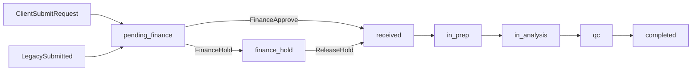

## **Sprint 3 Frontend Report: Workflow Alignment, Payment Gate & Blind Analyst Views**

**Date Completed:** 2026-06-01  
**Last Updated:** 2026-06-01  
**Status: PARTIAL** – Core Sprint 3 UI behaviors are implemented locally. Several backend Sprint 3 endpoints (departments, financial records, OTP reset) are not yet wired in the frontend.

---

## **1 Objective**

Sprint 3 on the frontend aligned the LSIMS portal with the updated backend workflow delivered in Sprint 3. The main goals were:

- Show finance-gated job intake before laboratory processing begins.
- Handle samples that may not yet have permanent identifiers (`sample_code`).
- Provide blind analyst views that hide client identity.
- Enforce role-based staff navigation and operational permissions.
- Support client self-service job requests with finance review messaging.

This report documents what the **frontend** implemented, how it maps to the backend Sprint 3 report, and what remains outstanding.

---

## **2 Sprint 3 Scope Delivered (Frontend)**

| **Area** | **Delivered in Sprint 3 (Frontend)** |
|---|---|
| Payment-gated workflow | Jobs display `pending_finance` (and legacy `submitted`) as awaiting finance approval before moving to `received`. |
| Finance staff UI | `StaffFinancePage` lists awaiting jobs, approves to `received`, and manages `finance_hold` releases. |
| Client job submission | 3-step wizard (`ClientNewJobRequestForm`) posts to job API; success messaging explains finance review. |
| Null / pending sample IDs | UI uses `sample_code ?? blind_alias_code ?? "—"` across sample list and detail views. |
| Blind analyst views | Analyst sample detail detects blind payloads and hides client identity fields. |
| Role-based routing | `StaffRouteGate` + `staff-route-access.ts` restrict staff nav by `role_detail.role_name`. |
| User management | Admin CRUD for users and roles; admin password reset via change-password endpoint. |
| Job role holds | `blocked_by_role` badge on job rows; receptionist/admin can set holds in job detail. |
| Dashboard visibility | Staff dashboard pipeline highlights `pending_finance` / `submitted` counts. |

---

## **3 Workflow Changes Implemented**

### **3.1 Finance-Gated Job Intake**

The frontend models the payment/finance gate through job status, not through a dedicated financial-record UI.

| **Workflow Step** | **Frontend Behavior** |
|---|---|
| Client submits new request | POST `/api/laboratory/jobs/` via wizard; toast explains finance will review before lab intake. |
| Job appears in finance queue | `StaffFinancePage` lists jobs with `pending_finance` or legacy `submitted`. |
| Finance approves job | PATCH job `current_status: "received"` (admin or receptionist only). |
| Finance places hold | PATCH job `current_status: "finance_hold"` with optional reason. |
| Job advances in lab | Receptionist/admin manage downstream statuses via job detail and laboratory pages. |

**Key files:**

- `LSIMS-Frontend/src/features/jobs/client-new-job-request-form.tsx`
- `LSIMS-Frontend/src/pages/staff/lims-extensions/finance/StaffFinancePage.tsx`
- `LSIMS-Frontend/src/lib/job-order-labels.ts`
- `LSIMS-Frontend/src/types/laboratory.ts`

### **3.2 Job Status Flow (Frontend)**



Frontend `JobOrderStatus` union:

```
draft | submitted | pending_finance | received | in_prep | in_analysis | qc | finance_hold | completed
```

### **3.3 Sample Identity Before and After Payment**

Before permanent coding, the UI should expect nullable identity fields from the API:

```json
{
  "sample_code": null,
  "blind_alias": null,
  "blind_alias_code": null
}
```

After payment confirmation (backend behavior), the frontend refreshes sample data and displays populated codes.

**Display pattern used consistently:**

```typescript
const displayCode = sample.sample_code ?? sample.blind_alias_code ?? "—";
const isBlindView = !sample.sample_code && Boolean(sample.blind_alias_code);
```

When `isBlindView` is true:

- Header shows **"Blind sample"** with a note that client identifiers are hidden.
- `sample_name` is not shown in detail headers.
- Edit forms skip the sample name field for blind payloads.

**Key files:**

- `LSIMS-Frontend/src/pages/staff/analyst/analyst-sample-detail-panel.tsx`
- `LSIMS-Frontend/src/pages/staff/samples/sample-detail-panel.tsx`
- `LSIMS-Frontend/src/pages/staff/analyst/staff-analyst-section.tsx`

---

## **4 Terminology Alignment (Backend vs Frontend)**

| **Backend Sprint 3 Term** | **Frontend Term / Status** |
|---|---|
| `payment_pending` | **`pending_finance`** (+ legacy **`submitted`**) – not the same string as backend report |
| `FinancialRecord` API | **Not wired** – finance page patches job orders directly |
| `/api/accounts/departments/` | **Not used** – no department field or filter in frontend |
| OTP password reset endpoints | **Not wired** – `/forgot-password` is an informational placeholder |
| `country` on profile | Frontend types/API use **`nationality`**; self-service profile edit for org fields is partially disabled in UI |
| Department isolation | **Backend-only** – frontend assumes API scoping; no department UI filters |

---

## **5 Pages and Routes Delivered**

### **5.1 Route Map**

Defined in `LSIMS-Frontend/src/routes/config.tsx`.

| **Zone** | **Paths** |
|---|---|
| Public | `/`, `/login`, `/signup`, `/forgot-password` |
| Staff | `/staff/*` – dashboard, laboratory, analyst, results, qc, reports, finance, inventory, instruments, compliance, scheduling, notifications, users, profile, settings |
| Client | `/client/*` – dashboard, requests, notifications, profile |
| Redirect | `/staff/samples` → `/staff/analyst` |
| Disabled | `/client/results` – route commented out |

### **5.2 Role-Based Staff Access**

From `LSIMS-Frontend/src/lib/staff-route-access.ts` and `staff-permissions.ts`.

| **Role / User Type** | **Frontend Access Behavior** |
|---|---|
| **admin** | All staff routes including `/staff/users` |
| **receptionist**, **qc_manager**, **finance**, **procurement**, **ministry_coordinator**, **auditor** | All operational routes except `/staff/users` |
| **analyst** | Dashboard, laboratory, analyst, results, scheduling, inventory, instruments, compliance, notifications, profile, settings – **excludes** finance, qc, reports, users |
| **superuser** | All staff routes |
| **external client** | Client zone only (`/client/*`) |

### **5.3 Operational Capability Helpers**

| **Capability** | **Who (Frontend)** |
|---|---|
| `canManageJobsAndSamples` | admin, receptionist, superuser |
| `canIntakeSamples` | receptionist, superuser |
| `canManageTestCatalog` | admin, superuser |
| `isStaffAdmin` | admin role or superuser |
| `isStaffAnalyst` | analyst role |

Finance officers can **view** finance queues; **approve/hold** actions require `canManageJobsAndSamples` (admin or receptionist). A read-only banner is shown when the user lacks write access.

---

## **6 Tech Stack Summary**

| **Layer** | **Technology** |
|---|---|
| UI framework | React 18 + TypeScript |
| Build tool | Vite |
| Routing | React Router (`routes/config.tsx`) |
| Server state | TanStack React Query |
| HTTP client | Axios (`src/api/client.ts`) |
| Auth state | Zustand (`src/stores/auth-store.ts`) |
| Token storage | `sessionStorage` (`lsims_access`, `lsims_refresh`) |
| Styling | Tailwind CSS + shadcn/ui components |
| Forms / validation | React Hook Form + Zod schemas |

---

## **7 Frontend Integration Notes**

These are the main Sprint 3 behaviors the frontend implements against the backend:

| **Backend Behavior** | **Frontend Handling** |
|---|---|
| New client jobs start awaiting finance | Show **Pending finance** badge; finance page lists awaiting queue |
| Samples may lack permanent IDs | Display pending state via blind alias fallback or em dash |
| Payment confirmation creates sample identity | Refresh job/sample queries after finance approval (React Query invalidation) |
| FinancialRecord controls payment state | **Gap:** no FinancialRecord UI; job PATCH used instead |
| Analysts are department-filtered (backend) | Empty lists treated as no records; no department filter UI |
| Analyst sample response is blind | `isBlindView` hides client identity and sample name |
| Password reset request is generic | **Gap:** no OTP flow; placeholder page directs users to admin reset |
| Client access restricted to owned records | Client pages call same job/sample APIs; backend scopes results |

---

## **8 Key Implementation Decisions**

1. **Finance gate via job status.** The frontend approves client requests by patching `current_status` to `received`, not by creating/updating `FinancialRecord` rows.

2. **Status naming differs from backend report.** Frontend uses `pending_finance` rather than backend document term `payment_pending`. Legacy `submitted` jobs are included in the finance awaiting queue for backward compatibility.

3. **Blind view detection is client-side.** The UI infers blind payloads when `sample_code` is absent but `blind_alias_code` is present.

4. **Department isolation is not surfaced in UI.** Restricted users may see empty lists; the frontend does not explain department scoping explicitly.

5. **Password change uses admin endpoint.** Profile password section calls `POST /api/accounts/users/:id/change-password/` for the signed-in user (requires admin/superuser on backend).

6. **Formula calculations remain out of scope.** No frontend calculation engine; aligns with backend Sprint 3 deferral.

---

## **9 Local Development Verification**

### **9.1 Start the Stack**

```bash
# From repository root
docker compose up

# In LSIMS-Frontend/
npm run dev
```

Frontend dev server: `http://localhost:5173`  
API base URL: `VITE_API_BASE_URL=http://localhost:8000` (see `LSIMS-Frontend/.env`)

Backend Swagger (reference): `https://lsims-api-staging.onrender.com/api/docs/`

### **9.2 Manual Verification Checklist**

| **Role** | **Check** |
|---|---|
| **Admin** | Users tab: create user (list refreshes), superuser badge, edit loads fresh row via `GET /users/:id/` |
| **Admin** | Roles tab: create, edit, delete role |
| **Admin** | Test catalog: delete row (or API error if referenced); toggle active |
| **Receptionist** | Job detail: set role hold (`blocked_by_role`), cancel with optional reason |
| **Finance / QC** | Job rows show hold badge when `blocked_by_role` is set |
| **Finance** | Finance page lists `pending_finance` jobs; approve moves job to `received` (as admin/receptionist) |
| **Client** | New request wizard loads live test catalog; submit creates job |
| **Client** | Dashboard shows active job count and recent statuses including pending finance |
| **Analyst** | Sample detail shows `blind_alias_id` when API returns analyst payload; client identity hidden |
| **Any user** | Notifications: metadata block when present; "Load full detail" fetches `GET /inbox/:id/` |

### **9.3 Sprint 3-Specific Checks**

| **Scenario** | **Expected Frontend Result** |
|---|---|
| Client submits new job | Success toast mentions finance review; job shows pending finance status |
| Finance awaiting queue | Jobs with `pending_finance` or `submitted` appear on finance page |
| Finance approve | Job status badge updates to **Received** after PATCH |
| Sample without `sample_code` | List/detail shows blind alias or em dash, not a permanent code |
| Analyst opens assigned sample | Blind sample header; no client name when API omits identity fields |
| Forgot password page | Informational message only; no OTP form |
| Admin user edit | `nationality`, `organization_type` fields available in admin dialog |

---

## **10 Known Limitations / Future Frontend Work**

| **Item** | **Status** |
|---|---|
| FinancialRecord CRUD UI | Not implemented – finance uses job PATCH only |
| Department picker / filter | Not implemented – no `/api/accounts/departments/` integration |
| OTP password reset flow | Placeholder page only – no `password-reset-request` / `confirm` calls |
| Full self-service profile edit | `nationality` / `organization_type` fields commented out in profile edit form |
| Client results route | Commented out in `routes/config.tsx` |
| Barcode/QR rendering | Not implemented – IDs displayed as text only |
| Analysis result capture | Results page exists; full analysis workflow deferred |
| QC decision workflow | QC page exists; formal decision models deferred |
| LIMS extension placeholders | Instruments, compliance, scheduling pages partially informational |

---

## **11 What Comes Next**

| **Priority** | **Frontend Focus** |
|---|---|
| High | Wire FinancialRecord create/update UI when billing workflow is confirmed |
| High | Implement OTP forgot-password flow against backend auth endpoints |
| High | Department field on user management and test catalog filtering |
| Medium | Re-enable client results route and results delivery UI |
| Medium | Align job status naming with backend (`payment_pending` vs `pending_finance`) if API changes |
| Medium | Re-enable full profile edit (nationality, organization_type) for self-service users |
| Low | Barcode/QR rendering after format approval |
| Low | Formula calculation UI only if confirmed as required |

---

## **12 Related Documentation**

| **Document** | **Purpose** |
|---|---|
| `docs/sprint3-report.md` | Backend Sprint 3 report |
| `docs/swagger-access.md` | Backend staging Swagger access guide |
| `docs/frontend-api-reference.md` | Frontend API integration reference (endpoints, auth, types) |
